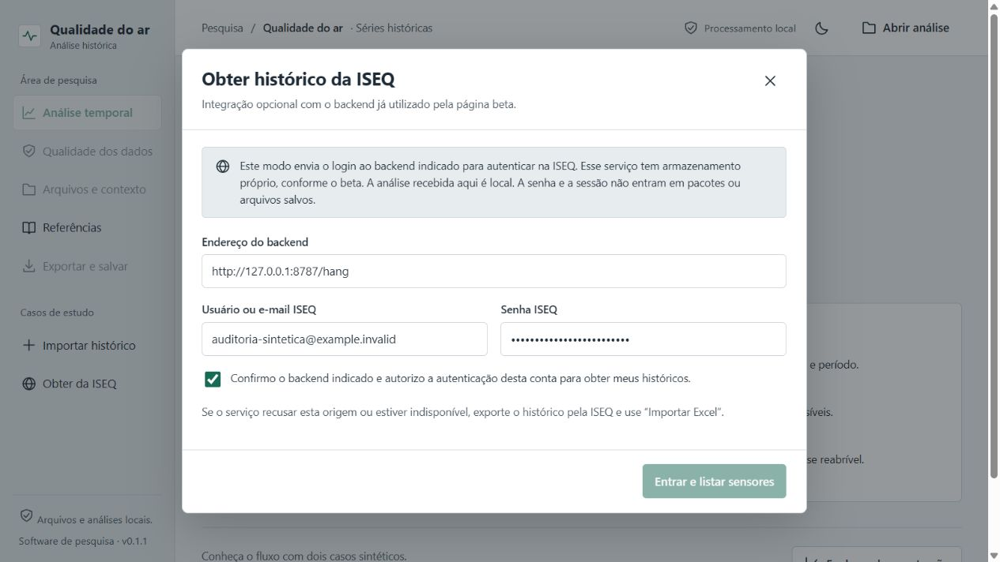
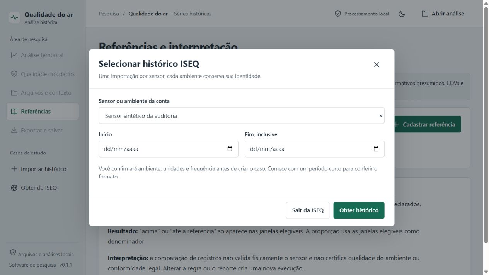
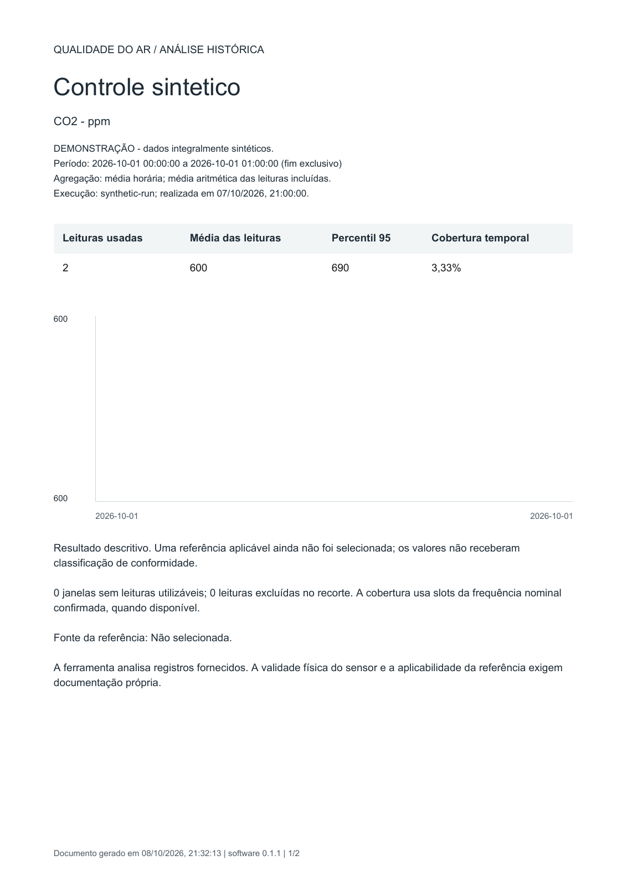

# Auditoria funcional multiagente — qualidade do ar

**Data:** 08/10/2026, America/Sao_Paulo. **Versão:** 0.1.1. **Código auditado:** `29ed8aaf6eba5cdcb9ee8867b7b82f1abcb272f0`.

## Resultado

**26 famílias de falhas confirmadas: 8 P1, 15 P2 e 3 P3.** Três agentes auditaram conexão, cálculo científico e arquivos; o coordenador reproduziu usos da interface em navegador. A rodada interrompida por limite de uso foi retomada até concluir os três relatórios. Achados repetidos entre agentes/navegador foram consolidados, sem somar o mesmo defeito duas vezes.

O travamento informado foi reproduzido com um backend controlado que não responde: após **75 segundos**, o botão continuava desabilitado, sem progresso, erro ou cancelamento. O código não estabelece prazo de resposta no login. Isso confirma o defeito da espera na ferramenta; não identifica, sozinho, por que o backend real demorou.

Os **24 testes existentes passaram**, mas não cobriam as falhas abaixo. Os novos scripts são sondagens que demonstram o comportamento defeituoso da versão auditada: seu sucesso significa que a reprodução foi confirmada, não que o software esteja livre de bugs. Há também controles positivos com gabaritos independentes.

As falhas foram documentadas, com reproduções e recomendações. O código de produção permanece o auditado; esta entrega não é uma versão corrigida nem uma validação do uso científico com dados reais.

## Prioridade

P1: bloqueia função principal ou pode comprometer a interpretação/rastreabilidade dos dados. P2: compromete fluxo, recuperação, apresentação ou proteção de informações. P3: menor impacto ou entrada artificial extrema. Não há achado P0 nesta rodada.

### P1 — corrigir antes do piloto científico

| ID | Falha confirmada | Evidência principal |
|---|---|---|
| ISEQ-01 | Login sem timeout/progresso/cancelamento; botão fica bloqueado se o servidor não responder | Promise pendente + navegador por 75 s |
| ISEQ-02 | Deadline de 20 min do histórico não alcança um fetch que permanece pendente | Relógio avançado artificialmente, operação não encerra |
| ARQ-01 | CSV altera números com vírgula e datas brasileiras antes da normalização | `600,5 → 6005`; `01/10 → 10/01` |
| ARQ-03 | Resultado arquivado é exportado/apresentado com contexto, decisões e fontes atuais | Cobertura antiga de 60 slots/h, método exportado com frequência de 300 s; confirmação visual adicional |
| CALC-01 | CO₂ externo em ppm é subtraído de CO₂ interno em ppb sem conversão | Diferença correta 200000; obtida 599600; classificação invertida |
| CALC-02 | CO₂ externo negativo é aceito e gera comparação admissível | Externo -200 ppm produz diferença 800 ppm |
| CALC-03 | ID do sensor no arquivo pode ser substituído pelo ID digitado e incorporado a outro ambiente | Arquivo HOSPITAL entra como SCHOOL; média 600 → 750 |
| CALC-04 | Arquivo marcado sintético entra em caso real sem conservar a marca | Caso continua `synthetic:false`; média real do fixture passa a incluir demonstração |

### P2 — fluxo, preservação, apresentação e acessibilidade

| ID | Falha confirmada | Consequência |
|---|---|---|
| ISEQ-03 | `detail:{code,message}` descartado | Erros úteis da ISEQ viram mensagens genéricas |
| ISEQ-04 | HTML/JSON inválido tratado como objeto vazio | Problema de resposta pode parecer ausência de registros |
| ISEQ-05 | Fechar login não encerra a operação | Resposta tardia substitui outro modal e perde formulário não salvo |
| ISEQ-06 | 401 limpa token, mas mantém interface conectada | Fluxo volta ao seletor inválido, sem exigir nova autenticação |
| ISEQ-07 | Logout só limpa sessão depois da resposta remota | Serviço pendente impede encerramento local |
| ISEQ-08 | Falha/abort do histórico não limpa estado de progresso | Spinner e controlador continuam após erro |
| ARQ-02 | Sistema de datas Excel 1904 ignorado | Data deslocada em 1462 dias |
| ARQ-04 | Compartilhável conserva decisões por observação | Justificativas podem revelar valores individuais que foram escritos nelas |
| ARQ-05 | Esquema do pacote não confere tipos/vínculo de IDs | Aceita `bins` como objeto ou caso/execução divergentes; quebra exportação |
| ARQ-06 | Geração/leitura têm limites diferentes | Pacote de 148 fontes é salvo, mas não reabre |
| ARQ-07 | Validação de todas as abas antes da escolha | Uma aba vazia ou mista impede importar outra aba válida |
| ARQ-08 | Gráfico PDF não desenha médias isoladas | Uma janela com média 600 aparece sem ponto no gráfico |
| CALC-05 | Contexto externo é compartilhado entre regras e perdido ao trocar caso | Cadastro de B muda resultado de A; alternar casos zera o valor |
| UI-01 | Alteração do caso acontece antes de uma edição recusada | Nome/contexto mudam sem a execução prometida ser criada |
| UI-02 | Controle Abrir análise perde nome acessível em celular | Texto oculto, SVG decorativo, ausência de rótulo acessível |

### P3 — robustez e estados menores

| ID | Falha confirmada | Limite do achado |
|---|---|---|
| ISEQ-09 | Conta sem sensores abre seletor obrigatório vazio | Reproduzido com contrato sintético válido e lista vazia |
| ISEQ-10 | Listeners de abort de polling não são removidos ao completar timer | Acúmulo confirmado; travamento ou crescimento expressivo de memória não foi demonstrado |
| CALC-06 | Estatísticas de valores finitos extremos viram Infinity/null | Fixture de 1e308; não é concentração ambiental plausível |

## Cobertura dos usos

| Uso | Verificação realizada | Situação |
|---|---|---|
| Tela inicial e demonstração | Dois ambientes, nove parâmetros, três gráficos e tabela | Controle positivo |
| ISEQ — caminho rápido | Login, MAC, job, paginação e formulário de importação com backend controlado | Controle positivo; autenticação real pendente |
| ISEQ — lento/sem resposta/erro/abort/logout | Reproduções CLI de contrato/callback + login pendente/tardio no navegador | Falhas confirmadas |
| XLSX amplo/longo, aba e metadados | Normalização, rejeição, prévia, unidades e qualidade | Fluxo normal aprovado; IDs/marca sintética/1904/abas com falhas |
| CSV | Datas/números brasileiros, ISO e fórmulas | Falha de localidade confirmada |
| Duplicatas e revisão manual | Idênticas, conflitos, escolhas justificadas e originais preservados | Controle positivo no escopo; identidade de origem continua crítica |
| Filtros, médias e cobertura | Horária/diária, slots, lacunas, janelas parciais, denominador elegível | Controles positivos; limitações do método documentadas |
| Referências | Unidade, janela, suficiência, escopo e método; CO₂ externo | Gates usuais aprovados; contexto externo com falhas |
| Histórico | Reabrir resultados e selecionar execução anterior | Números preservados; contexto histórico incompleto |
| PDF, Excel e CSV | Gabarito 500/700 e download de sete janelas na interface | Concordância numérica; PDF de ponto isolado com falha |
| Pacotes | Completo, compartilhável, hashes, esquemas, limites, ida/volta | Caminho normal aprovado; falhas de sanitização/esquema/limites/edição |
| Design e acesso | Claro/escuro, desktop, 390 px, navegação, nomes de controles | Sem overflow nos estados exercitados; um rótulo móvel ausente |

## Evidências visuais da rodada

1. **Login pendente, sem progresso ou recuperação.** Conta e senha são fictícias, dirigidas ao backend local de auditoria.

2. **Resposta tardia substitui o cadastro que estava aberto.** A comparação antes/depois está no relatório da interface.

3. **PDF válido e tabela correta, mas a média isolada desaparece do gráfico.** O gabarito é integralmente sintético.

## Relatórios e reproduções

- [ISEQ: 10 famílias e 5 controles positivos](iseq.md).
- [Cálculos: 6 famílias e 9 controles positivos](calculos.md).
- [Arquivos: 8 famílias e controles de contrato](arquivos.md).
- [Interface: 2 famílias novas e confirmação visual dos achados anteriores](interface.md).
- [Roteiro de reprodução](REPRODUCAO.md).
- [Resultado dos 24 testes existentes](baseline-testes.txt).

Cada relatório informa arquivo/linha, passos, esperado/observado, gravidade, impacto e recomendação. Os scripts e entradas de arquivo são autorais/controlados, sem leituras institucionais. A captura anexada pelo usuário não foi copiada para o repositório.

## Ordem de correção e critério de saída

1. **Conexão:** prazo que alcance cada requisição, cancelamento/fechamento, progresso, validação de resposta, estados de sessão e logout local independente do servidor.
2. **Origem e entrada:** conferir sensor do arquivo contra caso; conservar natureza sintética; CSV sem coerção silenciosa; calendários Excel e validação por aba.
3. **Método:** contexto externo com unidade/domínio/origem, vinculado ao caso/execução; contexto, decisões e fontes arquivados por execução; operações transacionais.
4. **Preservação e saída:** sanitização compartilhável, esquema/IDs/tipos, limites coerentes, marcadores PDF e rótulo móvel.
5. **Regressão:** transformar os gabaritos em testes que exijam o comportamento correto; reproduzir novamente os mesmos fluxos no navegador e validar um período curto real da ISEQ com credenciais inseridas pelo pesquisador.

A versão seguinte deve demonstrar a correção das reproduções correspondentes. A simples aprovação dos 24 testes anteriores não encerra estes achados.

## Limites da conclusão

Esta é uma auditoria com código, gabaritos, simulações de falhas e usos de navegador; **não uma prova de que todos os bugs possíveis foram encontrados**. Login real, CORS/Render atual, dados institucionais, metrologia, referências normativas, todos os modelos de dispositivo/navegador, XLS antigo, grandes históricos reais e acessibilidade completa não foram validados. A ausência de achado nessas áreas significa não verificado, não aprovado.

Média aritmética sem ponderação pelo tempo, offset fixo e cobertura por slots já são escolhas/limitações documentadas. Não foram reclassificadas como defeitos sem um critério científico definido. Não houve afirmação de incidente de segurança nem de publicação de credenciais reais.
